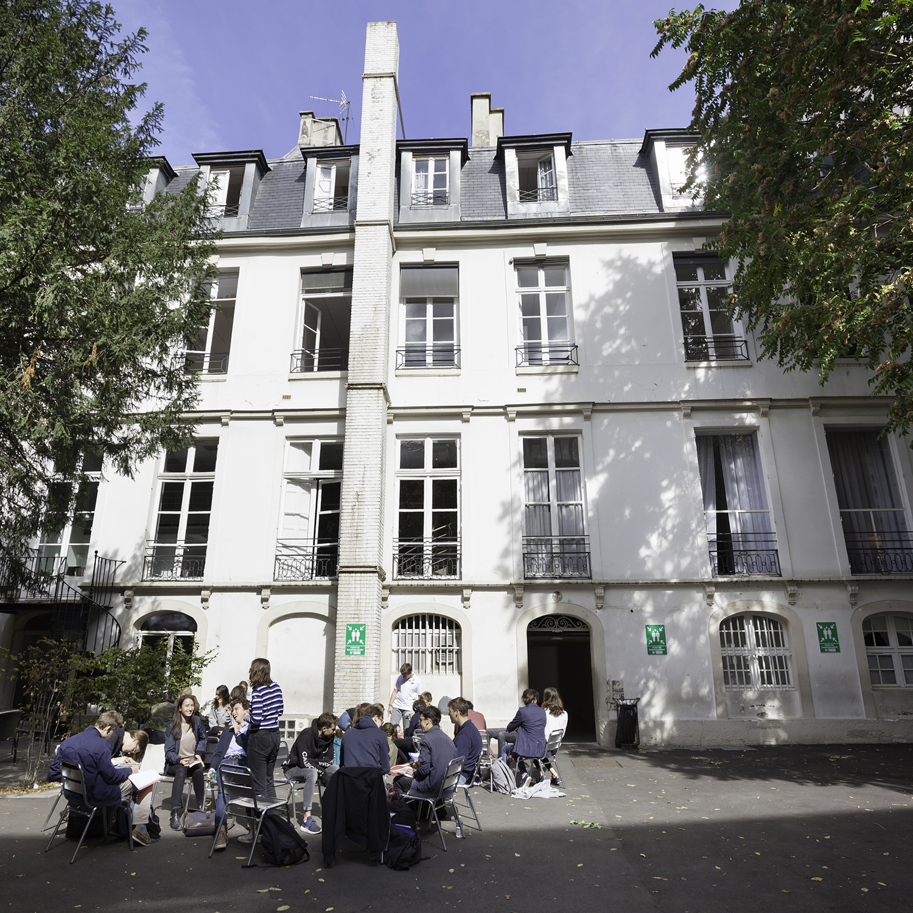

<!DOCTYPE html>
<html lang="en">
<head>
    <meta charset="UTF-8">
    <meta name="viewport" content="width=device-width, initial-scale=1.0">
    <link rel="stylesheet" type="text/css" href="style.css">
</head>
<body>

# 😁 Bonjour, bienvenue sur ma page Github
*Je m'appelle Timothée de Vasselot j'ai 20 ans et je suis étudiant à l'IIM en développement web*

    

         
    

## 🦾 Experience
Je viens d'un lycée général privé nommé Paul Claudel d'Hulst situé à Paris dans lequel j'ai obtenu mon baccalauréat mention assez bien.

    

         
    

## 🦹‍♂️ Personnalité et hobbies
Je suis quelqu'un d'assez curieux et profite souvent de mon temps libre pour tester de nouvelles choses. J'ai plusieurs passions telles que le sport (Musculation/cardio, Boxe, Football), histoire, lecture et désormais la programmation.

    

         
    

## 👨‍💻 Langues pratiquées
<table>
<tr>

   <td> 

         
    
</td>
    <td>

         
    
</td>
    <td>

         
    
</td>
    <td>

         
    
</td>
    </tr>
</table>

## 💬 Phrase inspirante
>"Il ne faut pas s'installer dans sa vérité et vouloir l'asséner comme une certitude, mais savoir l'offrir en tremblant comme un mystère"
>*Hélie de Saint-Marc*

## Réseaux

</body>
</html>
